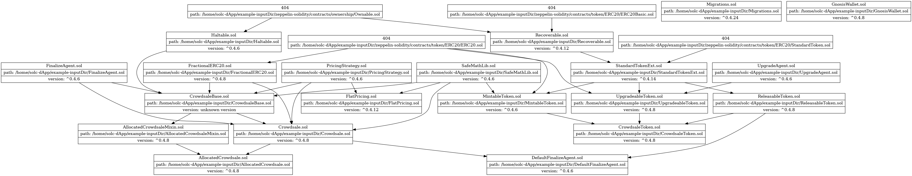

# Solc-dApp

A developing compiler for dApp featuring:
1. generate dependency graph for dApp.
2. automatically switch solc version for compiling.

A Sample Graph


# Dependency

solidity-parser=0.1.1

[solc-select](https://github.com/crytic/solc-select)

graphviz=0.20.1

# Usage

## Command Line Interface (CLI)

```
Usage: python3 ./main.py <options>

Options:
  -h, --help            
  -i, --inputDir <inputDir>           the dApp's folder
  -o, --outputDir <outputDir>         the output folder(default: ./output)
  -n, --contractName <contractName>   the name of file to be compiled
  -g, --graph                         generate the dependency graph
```

# Example

```
#> python3 main.py -i ./example-inputDir -g
#> python3 main.py -i ./example-inputDir -n Migrations
```